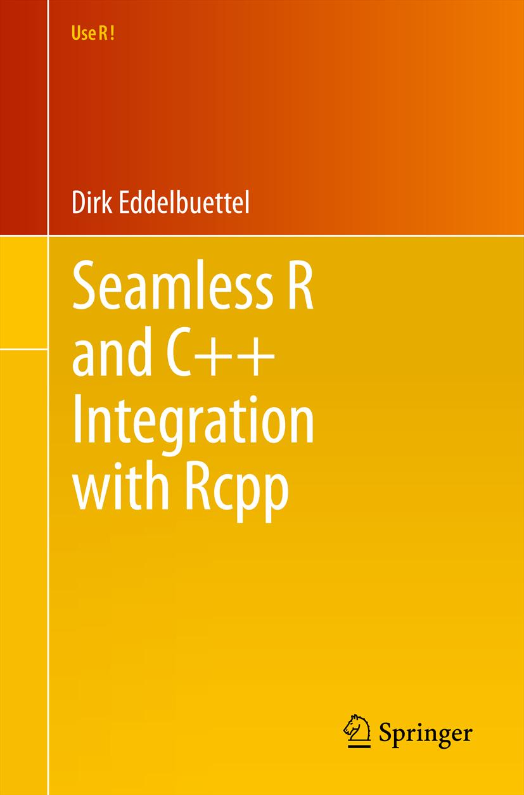

```{r setup, include=FALSE}
knitr::opts_chunk$set(echo = TRUE,comment = NA,prompt = TRUE,fig.align='center')
```

# R 的前世今生

## 来自何方

R was inspired by the S environment which has been principally developed by [John Chambers](https://www.wikiwand.com/en/John_Chambers_(statistician)), with substantial input from Douglas Bates, [Rick Becker](https://channel9.msdn.com/Events/Speakers/richard-becker), Bill Cleveland, [Trevor Hastie](http://web.stanford.edu/~hastie/), Daryl Pregibon and Allan Wilks.

## 来自何方

{ width=60% } \quad
{ width=30% }

## 来自何方

{ width=16% } \quad
{ width=16% } \quad
{ width=15.5% } \quad
{ width=16% } \quad
{ width=16% }

- 图片来自 <http://www.springer.com/> 和 <https://www.crcpress.com/>

- 官网 <https://www.r-project.org/doc/bib/R-books.html> 目前收录162本

## 创世者

R was initially written by __Robert Gentleman__ and __Ross Ihaka__ also known as __R & R__ of the Statistics Department of the University of Auckland.

- [Robert Gentleman](https://mediacenter.23andme.com/company/leadership/) joined [23andMe](https://www.23andme.com/) in 2015 as VP of computational biology
- [Ross Ihaka](https://www.stat.auckland.ac.nz/~ihaka/)

## 何去何从

1. 要到哪里去

R is **GNU S**, a freely available language and environment for statistical computing （统计计算）and graphics （统计图形）

- 1997年4月23日发布版本 0.49 至 2017年9月28日 发布版本 3.4.2 （已历20载）

2. 现在做了什么

R provides a wide variety of statistical and graphical techniques: linear and nonlinear modelling, statistical tests, time series analysis, classification, clustering, etc.

- 可以看看 CRAN 的 [TaskViews 栏目](https://mirrors.tuna.tsinghua.edu.cn/CRAN/web/views/)
- 还可以看看 [Bioconductor 官网](https://bioconductor.org/)

# SPSS 的替代品

## Rattle: A GUI for Data Mining using R [@rattle]

{ width=90% }

## Rcmdr: A platform-independent basic-statistics GUI for R [@RCommander2017John]

{ width=90% }

## Rcmdr 用户界面

```{r gui,echo=FALSE,fig.cap='Rcmdr 用户界面',out.width='.9\\linewidth'}
knitr::include_graphics('Rcmdr-screenshot.jpg')
```

## 致谢

- 谢益辉 <https://yihui.name/> for knitr [@book-knitr] and bookdown [@bookdown]
- 统计之都 <https://cosx.org/> 
- 论坛 <https://d.cosx.org/>


## Q & A

- \faGithub{} Cloud2016 
- \faGroup{} Capital of Statistics 
- \faLink{} <https://cosx.org/members/>


# 附录 {-}

## 谢益辉 {#yihui}

- \faLink{} 个人主页 <http://yihui.name/>
- \faGithub{} 个人主页 <https://github.com/yihui/>

